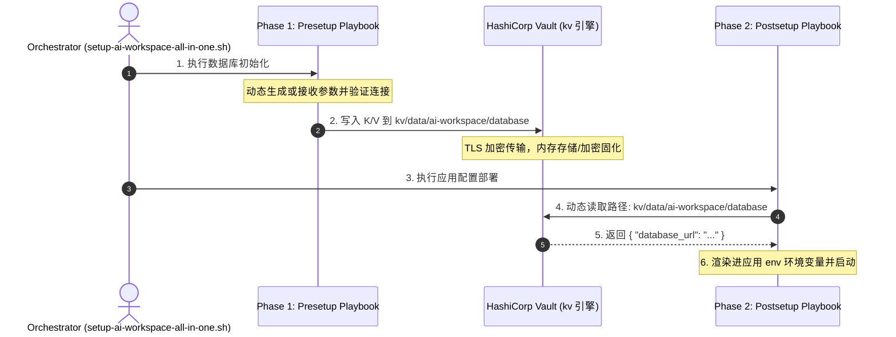

# 基于 HashiCorp Vault 的 Playbook Role 间安全密钥流转设计

本方案设计了在 `presetup`（前置准备/状态建置）与 `postsetup`（应用部署/配置后置）阶段之间，利用 HashiCorp Vault 密钥引擎作为状态中介，实现跨阶段、跨 Role 间密钥零落盘与安全传递的声明式架构。

本设计参考了 [vault_s3.yml](file:///Users/shenlan/workspaces/ai-workspace-infra/playbooks/group_vars/all/vault_s3.yml) 中已实现的 S3 凭证动态提取模式。

---

## 1. 背景与核心问题

在分离式部署流程中，前置阶段（如 [create_databases_and_users.yml](file:///Users/shenlan/workspaces/ai-workspace-infra/playbooks/create_databases_and_users.yml)）负责创建数据库用户、密码与专属 Schema。由于 these 敏感连接串（如 `POSTGRESQL_DATABASE_URL`）是动态生成或来自外部的：
1. **跨运行丢失问题**：在 `AI_WORKSPACE_SPLIT_PHASES=true` 模式下，多阶段运行导致内存 Fact 丢失。
2. **磁盘泄露问题**：直接将明文密码写入宿主机临时文件存在安全合规风险。
3. **紧耦合问题**：后置部署 Role 需要知道密码的生成细节或过度依赖前置 Task 的输出。

---

## 2. 总体架构设计

通过将 Vault 作为“密钥单点事实来源（Single Source of Truth）”，实现跨生命周期的零信任传递。



---

## 3. 密钥规范与路径定义

* **Secret Engine**: KV V2 (`engine_mount_point='kv'`)
* **路径 (Path)**: `ai-workspace/database`
* **敏感键 (Key)**: `database_url`
* **值 (Value)**: `postgres://<user>:<password>@<host>:<port>/<dbname>?sslmode=disable`

---

## 4. 具体任务与变量定义规范

### 4.1 Presetup 写入规格 (Write Path)

在前置准备 Role（如 `roles/vhosts/postgres`）中，确保在建库成功后，敏感连接串通过 API 安全写入 Vault。

```yaml
- name: Securely write database connection string to Vault KV
  community.hashi_vault.vault_write:
    url: "{{ lookup('ansible.builtin.env', 'VAULT_ADDR') | default('https://vault.svc.plus', true) }}"
    auth_method: token
    token: "{{ lookup('ansible.builtin.env', 'VAULT_TOKEN') }}"
    path: "kv/data/ai-workspace/database"
    data:
      database_url: "{{ postgresql_database_url }}"
  # 仅当启用 Vault 且持有 Token 时执行
  when:
    - vault_deploy_mode in ['external', 'standalone']
    - lookup('ansible.builtin.env', 'VAULT_TOKEN') | length > 0
  no_log: true
```

### 4.2 Postsetup 声明式感知查询 (Read Path)

在消费端 Role（如 `roles/vhosts/x_memory_hub` 或 `roles/vhosts/litellm`）中，在变量定义层面设计“环境感知型查询”：

```yaml
# defaults/main.yml

# 1. 动态抓取 Vault K/V
vault_database_secret_query: >-
  {{
    lookup('community.hashi_vault.vault_kv2_get',
      'ai-workspace/database',
      engine_mount_point='kv',
      url=lookup('ansible.builtin.env', 'VAULT_ADDR') | default('https://vault.svc.plus', true),
      auth_method='jwt' if lookup('ansible.builtin.env', 'VAULT_JWT_TOKEN') else 'token',
      jwt=lookup('ansible.builtin.env', 'VAULT_JWT_TOKEN') | default(omit, true),
      token=lookup('ansible.builtin.env', 'VAULT_TOKEN') | default(omit, true)
    ).secret
    if (lookup('ansible.builtin.env', 'VAULT_TOKEN') or lookup('ansible.builtin.env', 'VAULT_JWT_TOKEN'))
    else {}
  }}

# 2. 声明式环境组合感知（自适应回退）
postgresql_database_url: >-
  {{
    lookup('ansible.builtin.env', 'POSTGRESQL_DATABASE_URL')
    | default(vault_database_secret_query.database_url | default('', true), true)
    | default('postgresql://' + postgresql_admin_user + ':' + postgresql_admin_password + '@' + postgresql_host + ':' + postgresql_port | string + '/' + postgresql_database, true)
  }}
```

---

## 5. 优雅降级与环境感知说明

本方案遵循 **零硬编码与优雅降级** 准则：

1. **流水线 JWT 友好**：支持 `VAULT_JWT_TOKEN` 动态身份绑定认证，完美对接 GitHub Actions 或 GitLab CI 等无秘钥流程。
2. **外部注入优先**：如果容器化启动脚本（如 [setup-ai-workspace-all-in-one.sh](file:///Users/shenlan/workspaces/ai-workspace-lab/xworkspace-console/scripts/setup-ai-workspace-all-in-one.sh)）已经显式定义并导出了 `POSTGRESQL_DATABASE_URL` 环境变量，Ansible 将直接采用此变量，无需发起任何网络请求。
3. **断网/本地降级**：在无 Vault 环境下（如纯本地单元测试），系统自动退回到使用单个变量组件拼接默认值的逻辑，保证单体 Role 的独立可测试性。

---

## 6. GitHub Actions OIDC 角色与策略配置 (UAT/Prod Environments)

当流水线（如 `deploy-env-migration.yaml`）需要动态写入凭证（如为新部署的节点写入自动生成的 Xray UUID、各组件 PostgreSQL 密码）时，必须在 Vault 中配置允许更新特定路径的 JWT 鉴权角色和策略。

**注意：切勿使用 GitHub Secrets 静态存储此类易变凭证。所有的凭证都应由 OIDC → Vault JWT 动态获取。**

### 6.1 配置 Vault Policy

Vault 管理员需要更新 `github-actions-site-migration-toolkit` 策略，以授予其写入 `kv/data/+/databases` 和 `kv/data/+/agent-proxy` 等按需生成的动态环境路径的权限：

```hcl
# 共享 CICD 键
path "kv/data/CICD" {
  capabilities = ["read"]
}
path "kv/metadata/CICD" {
  capabilities = ["read", "list"]
}

# Web SaaS 域专属键
path "kv/data/WEB_SAAS" {
  capabilities = ["read"]
}
path "kv/metadata/WEB_SAAS" {
  capabilities = ["read", "list"]
}

# 动态生成的环境凭证写入与读取权限 (以匹配 kv/data/uat/*, kv/data/prod/* 等)
# 允许自动建库流水线创建、更新和读取数据库凭证
path "kv/data/+/databases" {
  capabilities = ["read", "create", "update", "patch"]
}
path "kv/metadata/+/databases" {
  capabilities = ["read", "list"]
}

# 允许 Xray 代理服务写入与读取自动生成的 UUID
path "kv/data/+/agent-proxy" {
  capabilities = ["read", "create", "update", "patch"]
}
path "kv/metadata/+/agent-proxy" {
  capabilities = ["read", "list"]
}
```

### 6.2 配置 JWT Role

Role 应绑定上述 Policy，并只信任本仓库的 Action：

```bash
vault write auth/jwt/role/github-actions-site-migration-toolkit - <<'EOF'
{
  "role_type": "jwt",
  "user_claim": "repository",
  "bound_audiences": ["vault"],
  "bound_claims_type": "glob",
  "bound_claims": {
    "repository": "ai-workspace-infra/site-migration-toolkit",
    "sub": "repo:ai-workspace-infra/site-migration-toolkit:*"
  },
  "token_policies": ["github-actions-site-migration-toolkit"],
  "token_ttl": "20m",
  "token_max_ttl": "30m"
}
EOF
```

一旦部署上述 Policy 与 Role，流水线将自动通过 `vault_env_path` (如 `uat`) 进行上下文隔离存储，保障不同部署环境密钥生命周期的独立与安全性。
