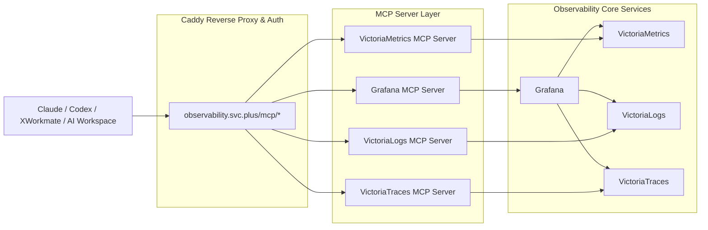

# Observability Server Role (`docker/observability-server`)

部署并托管 **VictoriaMetrics**, **Grafana**, **VictoriaLogs**, **VictoriaTraces** 以及对应的 **MCP (Model Context Protocol) Servers**，为 AI Agent (Claude, Codex, XWorkmate, AI Workspace) 提供统一的安全只读查询调试接口。

---

## 1. 架构图



---

## 2. 默认端口规划与 Endpoint 统一暴露全清单

### 2.1 可观测性核心服务 Endpoints
| 服务组件 | 容器服务名 | 宿主机端口 | Caddy 统一网关 Ingress 路径 | 核心功能与职责 |
| :--- | :--- | :--- | :--- | :--- |
| **Grafana UI** | `xstream_grafana` | `127.0.0.1:3030` | `https://observability.svc.plus/grafana/` | 统一可视化大盘面板与告警管理 |
| **VictoriaMetrics (Metrics)** | `xstream_victoriametrics` | `127.0.0.1:9090` | 写入: `/ingest/metrics/*`<br>查询: `/vmetrics/*` | Prometheus 协议指标数据 Remote Write 接收与 MetricsQL 查询 |
| **VictoriaLogs (Logs)** | `xstream_victorialogs` | `127.0.0.1:9428` | 写入: `/ingest/logs/*`<br>查询: `/vlogs/*` | JSON Lines 日志流式写入与 LogsQL 高基数检索 |
| **VictoriaTraces (Traces)** | `xstream_victoriatraces` | `127.0.0.1:10428` | OTLP/HTTP 写入: `/ingest/otlp/v1/traces` → `/insert/opentelemetry/v1/traces`<br>查询: `/vtraces/*` | OpenTelemetry (OTLP/HTTP) 链路接收与 TraceQL 查询 |
| **Blackbox Exporter** | `xstream_blackbox` | `127.0.0.1:9115` | `/blackbox/*` | 网络、域名、HTTP/TCP 探针拨测 |

### 2.2 Model Context Protocol (MCP) Server 阵列 Endpoints
| MCP 服务组件 | 容器服务名 | 宿主机端口 | Caddy 统一网关路径 (Legacy & AI Standard) | 默认状态 |
| :--- | :--- | :--- | :--- | :--- |
| **Grafana MCP Server** | `xstream_mcp_grafana` | `127.0.0.1:8000` | `/mcp/grafana/mcp`<br>`/mcp/v1/grafana/mcp` | 默认启用 |
| **VictoriaMetrics MCP Server** | `xstream_mcp_victoriametrics` | `127.0.0.1:8088` | `/mcp/victoriametrics/mcp`<br>`/mcp/v1/metrics/mcp` | 默认启用 |
| **VictoriaLogs MCP Server** | `xstream_mcp_victorialogs` | `127.0.0.1:8081` | `/mcp/victorialogs/mcp`<br>`/mcp/v1/logs/mcp` | 默认关闭（8081 由 xray-exporter 占用） |
| **VictoriaTraces MCP Server** | `xstream_mcp_victoriatraces` | `127.0.0.1:8082` | `/mcp/victoriatraces/mcp`<br>`/mcp/v1/traces/mcp` | 默认启用 |

---

## 3. 变量列表 (`defaults/main.yml`)

```yaml
# 全局控制变量
observability_mcp_enabled: true
observability_mcp_network: "observability"
observability_mcp_bind_address: "127.0.0.1"

# 网关统一认证 (Basic Auth)
observability_mcp_auth_enabled: true
observability_mcp_auth_vault_path: "kv/data/observability/mcp"
observability_mcp_basic_auth_user: "mcp_agent"
observability_mcp_basic_auth_password_hash: ""

Vault must contain `MCP_BASIC_AUTH_USER`, `MCP_BASIC_AUTH_PASSWORD`, and
`MCP_BASIC_AUTH_PASSWORD_HASH` at `kv/data/observability/mcp`. The plaintext
password is for MCP client configuration only; Caddy uses the hash. When
Grafana MCP is enabled, the same Vault record must also contain
`GRAFANA_SERVICE_ACCOUNT_TOKEN`; the token is written only to the generated
`mcp-grafana.env` file and is never committed to Git.

# Grafana MCP Server
observability_mcp_grafana_enabled: true
observability_mcp_grafana_image: "grafana/mcp-grafana:latest"
observability_mcp_grafana_port: 8000
observability_mcp_grafana_transport: "streamable-http"
observability_mcp_grafana_disable_write: true
observability_mcp_grafana_url: "http://grafana:3000"
observability_mcp_grafana_service_account_token: ""
observability_mcp_grafana_allowed_hosts: "observability.svc.plus,127.0.0.1,127.0.0.1:8000,localhost,localhost:8000"

# VictoriaMetrics MCP Server
observability_mcp_victoriametrics_enabled: true
observability_mcp_victoriametrics_image: "ghcr.io/victoriametrics/mcp-victoriametrics:latest"
observability_mcp_victoriametrics_port: 8088
observability_mcp_victoriametrics_mode: "http"
observability_mcp_victoriametrics_entrypoint: "http://victoria-metrics:8428"
observability_mcp_victoriametrics_instance_type: "cluster"
observability_mcp_victoriametrics_bearer_token: ""

# VictoriaLogs MCP Server（默认关闭，避免与 xray-exporter 的 8081 端口冲突）
observability_mcp_victorialogs_enabled: false
observability_mcp_victorialogs_image: "ghcr.io/victoriametrics/mcp-victorialogs:latest"
observability_mcp_victorialogs_port: 8081
observability_mcp_victorialogs_entrypoint: "http://victoria-logs:9428"
observability_mcp_victorialogs_bearer_token: ""

# VictoriaTraces MCP Server
observability_mcp_victoriatraces_enabled: false
observability_mcp_victoriatraces_image: "ghcr.io/victoriametrics/mcp-victoriatraces:latest"
observability_mcp_victoriatraces_port: 8082
observability_mcp_victoriatraces_entrypoint: "http://victoria-traces:10428"
observability_mcp_victoriatraces_bearer_token: ""
```

---

## 4. Secret 配置方式

为了保证凭据安全，敏感 Token （如 Grafana Service Account Token 和 Victoria Metrics/Logs/Traces Bearer Tokens）**不得明文提交至 Git 仓库**。

配置途径：
1. **Ansible Vault / Group Vars**:
   在 `group_vars/all/vault.yml` 或 `host_vars/<hostname>/vault.yml` 中配置加密变量：
   ```yaml
   vault_observability_mcp_grafana_service_account_token: "glsa_xxxxxx"
   vault_observability_mcp_victoriametrics_bearer_token: "secret-token"
   ```
2. **HashiCorp Vault**:
   在 Playbook 执行时从 Vault 读取对应 secret 填充至变量中。

Playbook 内部环境模板渲染任务均添加了 `no_log: true` 保护，防止在 CI/CD 日志中泄漏 Token。

---

## 5. 部署与更新命令

### 部署完整 Observability 栈（包含 MCP Server）
```bash
ansible-playbook playbooks/deploy_observability.yml
```

### 仅部署/更新 MCP Server 组件
```bash
ansible-playbook playbooks/deploy_observability.yml --tags observability_mcp
```

### 仅更新指定 MCP 子组件
```bash
ansible-playbook playbooks/deploy_observability.yml --tags mcp_grafana,mcp_victoriametrics
```

---

## 6. 健康检查与验证方法

部署完成后，任务会自动通过 `ansible.builtin.uri` 验证探针。

手动验证命令：
```bash
# 验证 Grafana MCP
curl -i https://observability.svc.plus/mcp/grafana/mcp

# 验证 VictoriaMetrics MCP
curl -i http://127.0.0.1:8080/health/readiness

# 通过网关暴露接口验证
curl -i https://observability.svc.plus/mcp/grafana
```

---

## 7. MCP Client 配置示例 (Claude / Codex / XWorkmate / AI Workspace)

在 Client 端的 MCP 配置文件（如 `mcp_config.json` 或 `claude_desktop_config.json`）中添加以下配置：

```json
{
  "mcpServers": {
    "grafana": {
      "transport": "streamable-http",
      "url": "https://observability.svc.plus/mcp/grafana/mcp"
    },
    "victoriametrics": {
      "transport": "streamable-http",
      "url": "https://observability.svc.plus/mcp/victoriametrics/mcp"
    },
    "victorialogs": {
      "transport": "streamable-http",
      "url": "https://observability.svc.plus/mcp/victorialogs/mcp"
    },
    "victoriatraces": {
      "transport": "streamable-http",
      "url": "https://observability.svc.plus/mcp/victoriatraces/mcp"
    }
  }
}
```

---

## 8. AI Agent 推荐调试流程

1. **第 1 步**：先通过 **Grafana MCP** 获取 Dashboard、Panel、Datasource 和告警上下文（理解系统当前整体监控状态）。
2. **第 2 步**：根据 Panel 查询表达式（MetricsQL/PromQL），通过 **VictoriaMetrics MCP** 验证与细化指标数据。
3. **第 3 步**：如果发现指标存在异常，通过 **VictoriaLogs MCP** 查询相同时间范围内的系统与服务日志。
4. **第 4 步**：如果日志中包含 `trace_id` 字段，通过 **VictoriaTraces MCP** 查询关联的完整微服务调用链。
5. **第 5 步**：输出排查结论时，必须包含查询时间范围、查询表达式、关键日志/链路证据及验证步骤。
6. **第 6 步**：所有 MCP 接口默认严格只读，不允许 AI Agent 修改 Dashboard、告警规则、数据源或底层可观测性数据。

---

## 9. 安全注意事项

- **只读策略**：Grafana MCP Server 必须默认启用 `--disable-write`，且限制暴露工具列表；Victoria* 系列 MCP 仅对接只读查询 API。
- **网络隔离**：MCP 容器仅绑定在内部网络或 `127.0.0.1`，不得将 8000/8080/8081/8082 端口直接开放到公网。
- **统一入口**：统一通过 Caddy 代理（`https://observability.svc.plus/mcp/*`），并可按需开启 Basic Authentication 保护。

---

## 10. 常见故障排查

1. **MCP 容器无法连接上游服务**：
   检查 `docker-compose.yml` 中的网络隔离设置与上游容器名（如 `grafana:3000`、`victoria-metrics:8428`）。
2. **Caddy 返回 502 Bad Gateway**：
   确认对应 MCP 容器已启动且监听在正确的内网端口（`docker ps | grep mcp`）。
3. **Grafana MCP 鉴权失败**：
   确认是否在 Grafana 中创建了拥有只读权限的 Service Account Token，并在 Vault/group_vars 中配置了 `observability_mcp_grafana_service_account_token`。
